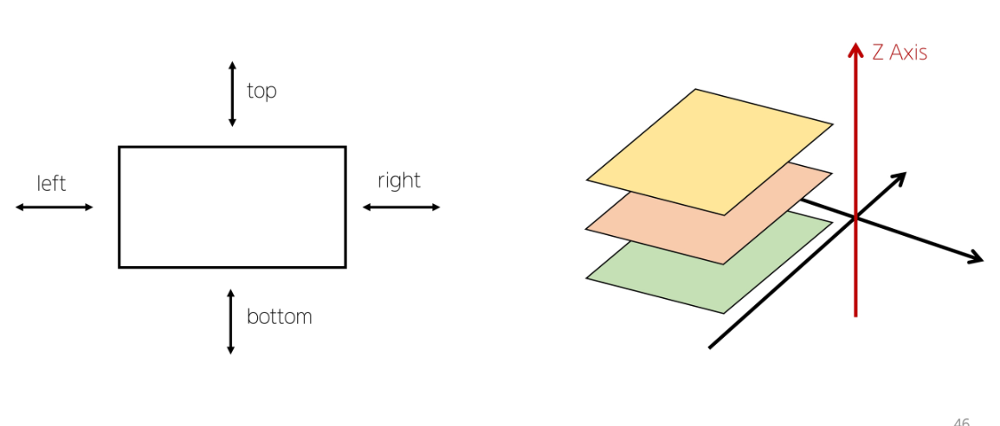

## Position
- 요소를 Normal Flow 에서 제거하여 다른 위치로 배치하는 방법
- ex) 다른 요소 위에 올리기, 화면의 특정 위치에 고정 등

  
## Position 의 이동방향

  
## Position 속성값
- static
  - 기본값으로 요소를 Normal Flow 에 따라 배치
 
- relative
  - static position 을 기준으로 상대적으로 이동
  - 요소가 차지하는 공간은 static 일 때와 동일
 
- absolute
  - 요소를 Normal Flow 에서 제거
  - 가장 가까운 relative 부모 요소를 기준으로 이동
  - 문서에서 해당 요소가 차지하는 공간이 없어짐
 
- fixed
  - 요소를 Normal Flow 에서 제거
  - 현재 viewport 를 기준으로 이동
  - 문서에서 요소가 차지하는 공간이 없어짐
 
- sticky
  - 요소를 Normal Flow 에 따라 배치
  - 스크롤이 임계점에 도달하면 그 위치에 fixed
  - 다음 sticky 요소가 나오면 이전 sticky 요소는 대체됨
  - sticky 요소를 담고 있는 부모 요소 영역을 기준으로 고정이 되기 때문에 부모 요소의 범위를 벗어나면 더 이상 고정이 되지 않음